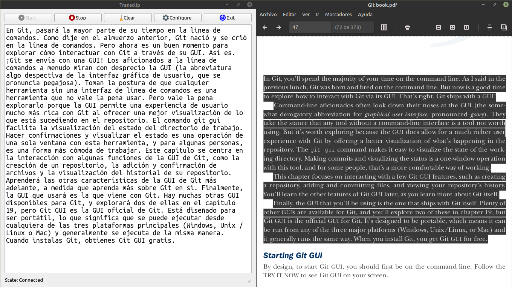

# Transclip



Este es un pequeño programa para usar la api de traducción de google y traducir el texto que se encuentra en el portapapeles.

## Construyendo
Para poder construir el proyecto, requieres el siguiente:
- Python 3 o superior

El proyecto trabaja sobre un entorno virtual, esto se debe de crear a través de virtualenv, para ello debes de instalarlo.

Ejecuta los siguientes comando de acuerdo a tu sistema operativo:
- Para windows y mac -> ```pip install virtualenv```
- Para linux -> ```pip3 install virtualenv```

Una vez que tengas virtualenv instalado, clona el repositorio y ejecuta en la terminal la siguiente linea para iniciar el entorno virtual:

```virtualenv Transclip``` __*esto iniciará el entorno virtual*__

Ahora lo que queda es __*activar*__ el entorno virtual:
- ``` cd Transclip ```
- Para windows y mac: ```/Scripts/activate ```
- Para linux: ``` source bin/activate ```

Por último debemos de instalar los módulos necesarios para arrancar el proyecto:

- ``` pip install -r requeriments.txt ```